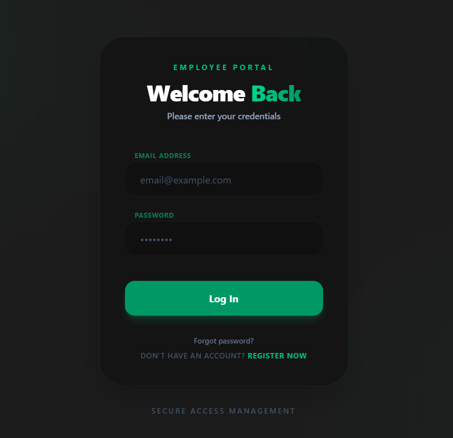
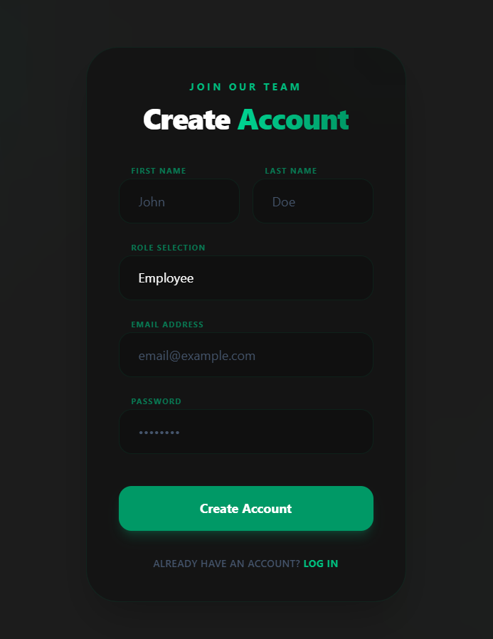
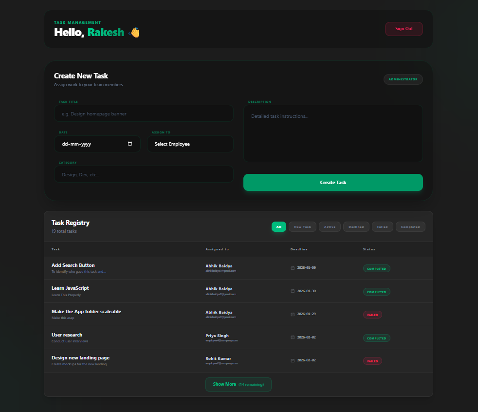
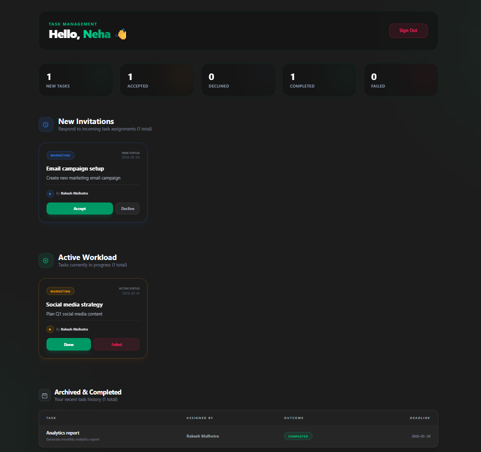

# ⚡Task Management App

A premium, real-time task management ecosystem designed for high-performance teams. Built with a focus on **visual excellence**, **real-time synchronization**, and **seamless UX**.


### 🛡️ Authentication

Experience a sleek, modern entry point for your team.

|                Login Screen                 |                Registration Screen                |
| :-----------------------------------------: | :-----------------------------------------------: |
|  |  |

---

## ✨ Features

### 👔 Administrator Portal

- **Centralized Task Control**: Create and assign tasks with metadata.
- **Live Task Registry**: Real-time monitoring of every task.
- **Smart Filtering**: Instant filtering by status (New, Active, Declined, Failed, Completed).
- **Dynamic Pagination**: Intelligent "Show More" system to handle large task volumes without performance lag.



### 👥 Employee Portal

- **Interactive Workload**: Respond to assignments in real-time.
- **Status Progression**: Update active tasks to 'Completed' or 'Failed' as work progresses.
- **Personalized Analytics**: Visual task statistics (Total, Pending, Completed, etc.).
- **Archive System**: Track your progress and history.



### 🚀 Core Technology

- **Engine**: React 18 + Vite (Ultra-fast HMR)
- **Real-time**: Socket.io for instant cross-device synchronization.
- **State Management**: Zustand (Lightweight & Reactive)
- **Styling**: Modern CSS with Glassmorphism and Backdrop Blur effects.
- **Architecture**: Modular component-based design for scalability.

---

## 🛠️ Tech Stack

### Frontend


### Backend


### Deployment & Tools


---

## 🛠️ Performance & UX Optimizations

### 🔄 Real-time Synchronization

The app leverages **WebSockets** to ensure that when an Admin assigns a task, it appears on the Employee's dashboard instantly without a page refresh.

### 📑 Smart Pagination System

To maintain a clean UI and optimize network traffic:

- **Initial Load**: Shows only the 5 latest activities.
- **Load More**: Seamlessly fetches next 5 items.
- **Collapse**: Revert to a compact view whenever needed.
- **Zero-Latency Filtering**: Status filters reset pagination state for a predictable experience.

### 🛡️ Secure Access

- **Dual Authentication**: Role-based access control (Admin vs. Employee).
- **Persistent State**: Automatic session recovery and state management.

## 📂 Project Structure

```bash
src/
├── components/        # Shared UI components (Layout, Header)
├── features/          # Domain-specific logic
│   ├── auth/          # Login & Registration flows
│   ├── dashboard/     # Role-based dashboard layouts
│   └── tasks/         # Task cards, forms, and registry
├── hooks/             # Custom API & Socket hooks
├── services/          # API & WebSocket configuration
└── main.jsx           # Application entry point
```

## 🚀 Getting Started

1. **Clone the repository**

   ```bash
   git clone https://github.com/07HypeR/employee_task_management_app.git
   ```

2. **Install dependencies**

   ```bash
   npm install
   ```

3. **Start Development Server**
   ```bash
   npm run dev
   ```

---

_Built with ❤️ by Abhik_
